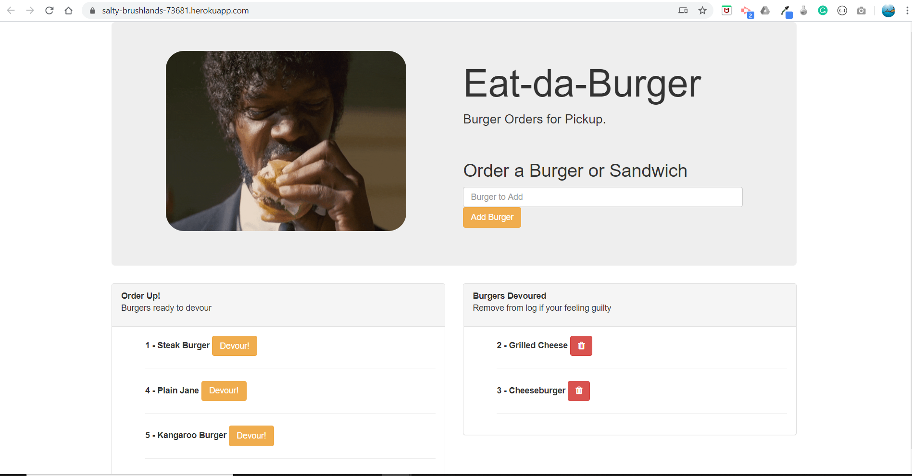

# burger
a burger logger with MySQL, Node, Express, Handlebars and a homemade ORM

## User Story
As a sandwitch consumer
I want to be able to organize and log my burgers eaten
So that I can deversify my burger consumption

## Description
a solution for ordering and logging burgers eaten.

## Installation
Clone to your local machine and open in your favorite code editor.  Open a bash terminal and do an "npm install" to get the node modules.  Run the schema in MySQL workbench to set up the tables and then use the seeds provided or make some of your own to sample the functionality of the app.  Go into the connection file and tailor the connection details to connect to your database.  Then type "node server.js" to run the application.  

## Technologies Utilized
MySQL, Node, Express, Handlebars and a homemade ORM

## Screen Shots
### Landing Screen

### Functionality

## Contributing
Pull requests are welcome. For major changes, please open an issue first to discuss what you would like to change.
Please make sure to update tests as appropriate.

## License
[MIT]
MIT License

Permission is hereby granted, free of charge, to any person obtaining a copy
of this software and associated documentation files (the "Software"), to deal
in the Software without restriction, including without limitation the rights
to use, copy, modify, merge, publish, distribute, sublicense, and/or sell
copies of the Software, and to permit persons to whom the Software is
furnished to do so, subject to the following conditions:

The above copyright notice and this permission notice shall be included in all
copies or substantial portions of the Software.

THE SOFTWARE IS PROVIDED "AS IS", WITHOUT WARRANTY OF ANY KIND, EXPRESS OR
IMPLIED, INCLUDING BUT NOT LIMITED TO THE WARRANTIES OF MERCHANTABILITY,
FITNESS FOR A PARTICULAR PURPOSE AND NONINFRINGEMENT. IN NO EVENT SHALL THE
AUTHORS OR COPYRIGHT HOLDERS BE LIABLE FOR ANY CLAIM, DAMAGES OR OTHER
LIABILITY, WHETHER IN AN ACTION OF CONTRACT, TORT OR OTHERWISE, ARISING FROM,
OUT OF OR IN CONNECTION WITH THE SOFTWARE OR THE USE OR OTHER DEALINGS IN THE
SOFTWARE.

- - - - -

